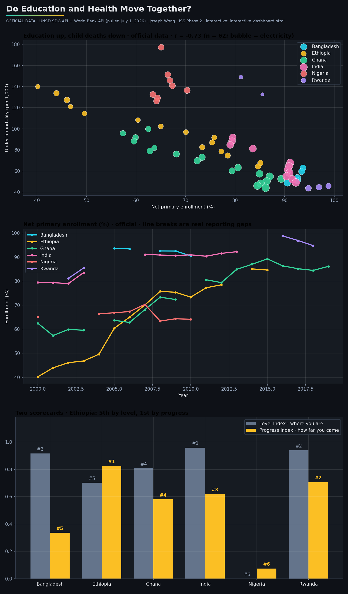

# SDG Education and Health Progress Analysis

This project analyzes whether education access and health outcomes move together across selected countries using public Sustainable Development Goal data.

The main idea is that binary "on-track/off-track" SDG labels can hide real progress. Instead of only asking whether countries have reached a final target, this project looks at trajectory: are indicators improving over time?

## Project Question

Do countries with improving education access also show improvements in child and maternal health outcomes?

## Data Sources

This project uses public data from:

- United Nations SDG API
- World Bank API

The dataset includes selected indicators related to:

- SDG 3: Good Health and Well-Being
- SDG 4: Quality Education
- SDG 7: Affordable and Clean Energy

## Countries Analyzed

- Ethiopia
- Ghana
- Rwanda
- Nigeria
- India
- Bangladesh

## Methods

This project includes:

- Python API data extraction
- Data cleaning and merging
- Correlation analysis
- Composite progress scoring
- Country ranking
- Interactive Plotly dashboard
- Excel-based validation workbook

## Key Findings

- Education enrollment and under-5 mortality showed a strong negative relationship in the official data.
- Ethiopia ranked lower on current level but higher on progress, showing why trajectory-based analysis matters.
- Nigeria remained a concern case, ranking low on both current level and progress.
- Some of the countries most in need of measurement also had the most incomplete official data.
- Progress rankings can tell a very different story from current-level rankings.

## Dashboard

View the interactive dashboard here:

[Open Interactive Dashboard](https://josephwong333.github.io/sdg-education-health-progress-analysis/dashboard/)



## How to Run

Install dependencies:

```bash
pip install -r requirements.txt
